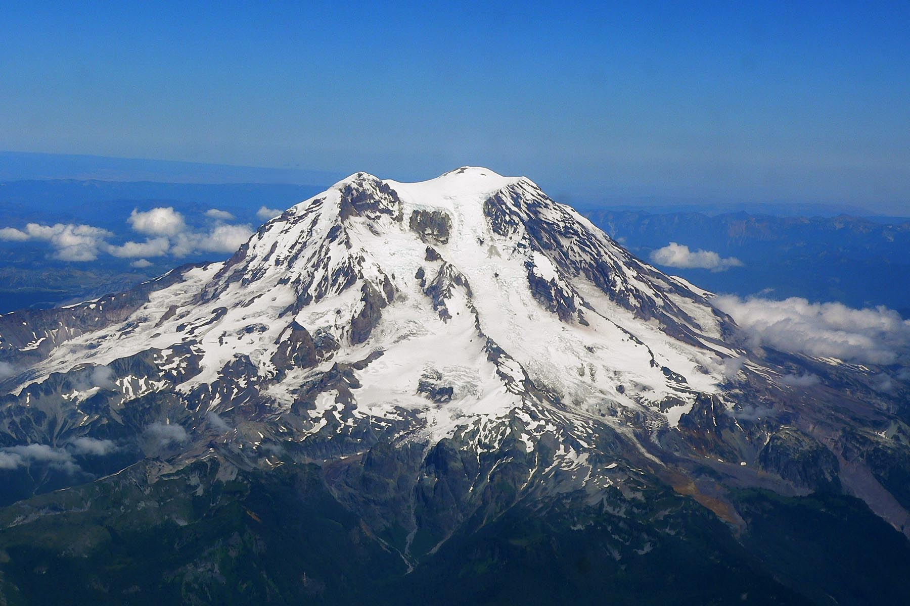

# Peak-bagging app for iPhone

Peaks is a free-to-download iPhone app for hikers and climbers who track mountain summits. It combines a public mountain guide, route planning, GPS ascent records, peak-list progress, photos, and trip reports. You can browse the guide on the web before a trip, then use the iPhone app to record the climb.

## What Peaks covers

The production catalog audit on August 23, 2026 counted:

- 82,977 mountain destinations, including summits, trailheads, lakes, and viewpoints
- 3,869 protected areas
- 15,447 published routes
- 25 curated peak lists

These are Peaks' own catalog figures, not estimates from a third-party keyword or review tool. The live totals can rise as the catalog grows.

## What to look for in a peak-bagging app

A useful peak-bagging app should connect the plan, the climb, and the record. Peaks lets you find a summit and its route, record distance, gain, time, and reached destinations, then keep that ascent in your personal history. Curated lists show which summits you have reached and what remains.

Start with the [live peak-bagging guide](https://getpeaks.app/activities/peak-bagging), [browse peaks by state](https://getpeaks.app/peaks), or open the [curated peak lists](https://getpeaks.app/lists).

## Common questions

### Is Peaks free?

Peaks is free to download from the [App Store](https://apps.apple.com/us/app/peaks-track-your-climb/id1497469000). Optional Peaks Premium features include offline maps and other advanced mountain tools.

### Is Peaks available on iPhone?

Yes. The native Peaks app runs on iPhone. The public guide at [getpeaks.app](https://getpeaks.app) also works in a web browser.

### Can Peaks track a peak list?

Yes. Peaks records the summits reached on each ascent and shows progress across curated mountain lists, including state high points and regional challenges.

### Does Peaks include route planning?

Yes. Peaks links summits, trailheads, protected areas, and published routes so you can check the route before recording the trip.

Return to the [Peaks project overview](../README.md).
