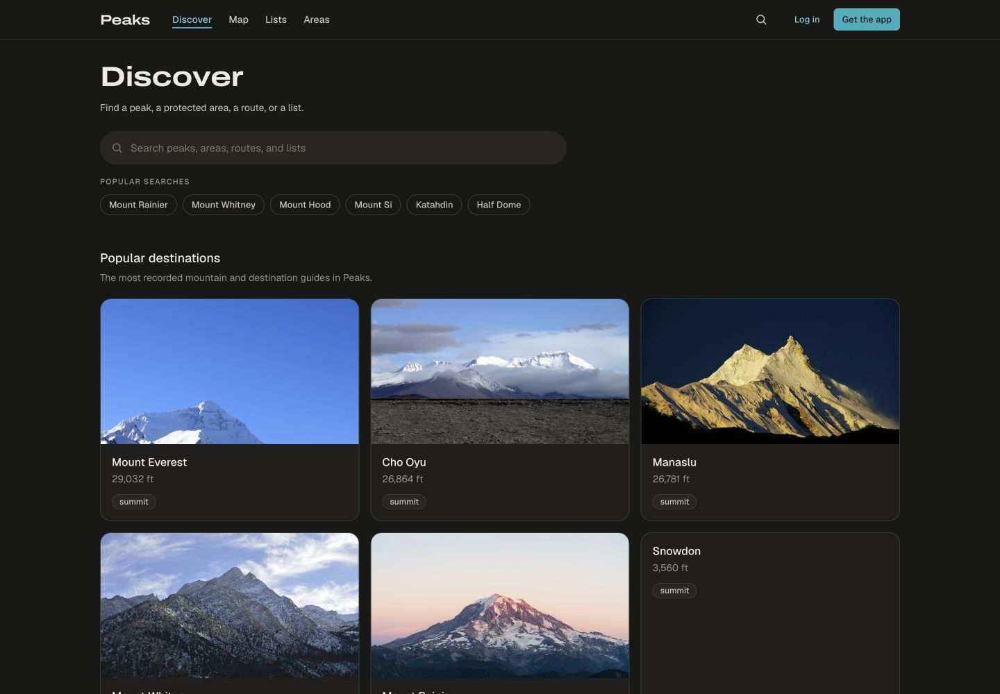
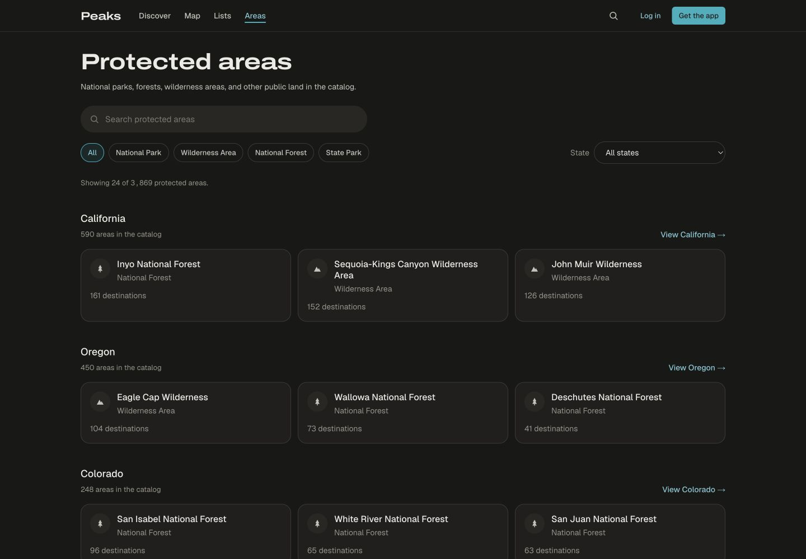
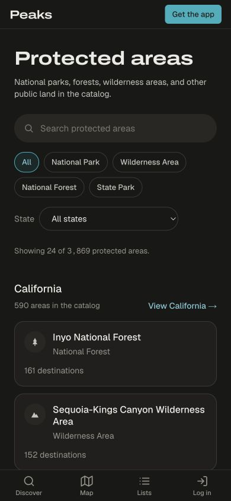
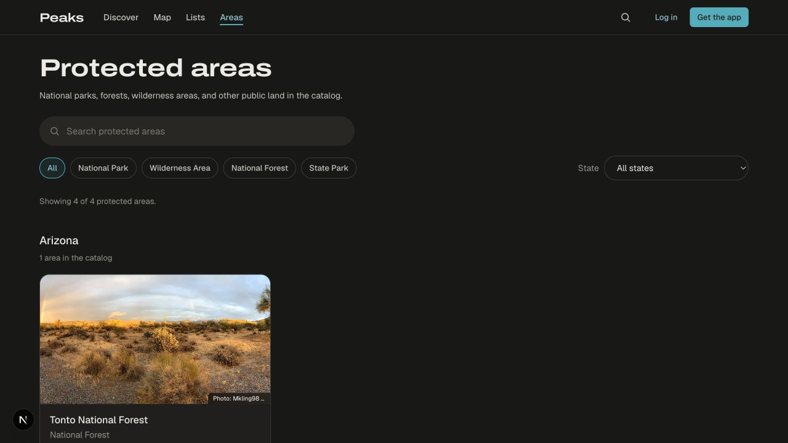
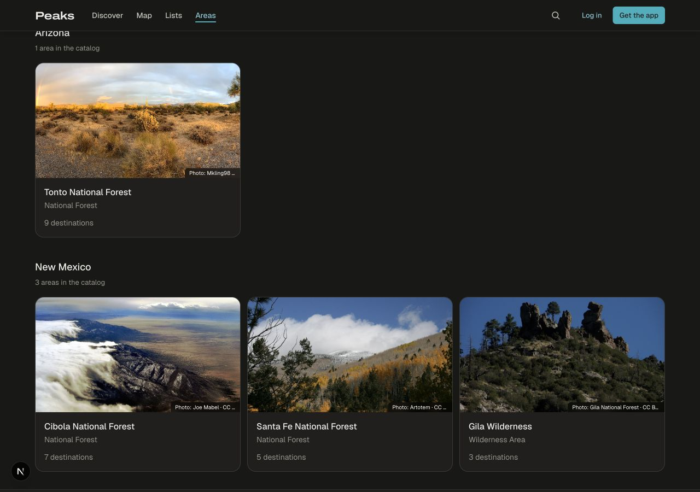
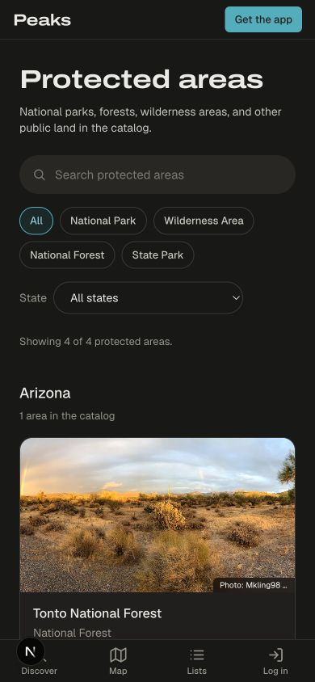
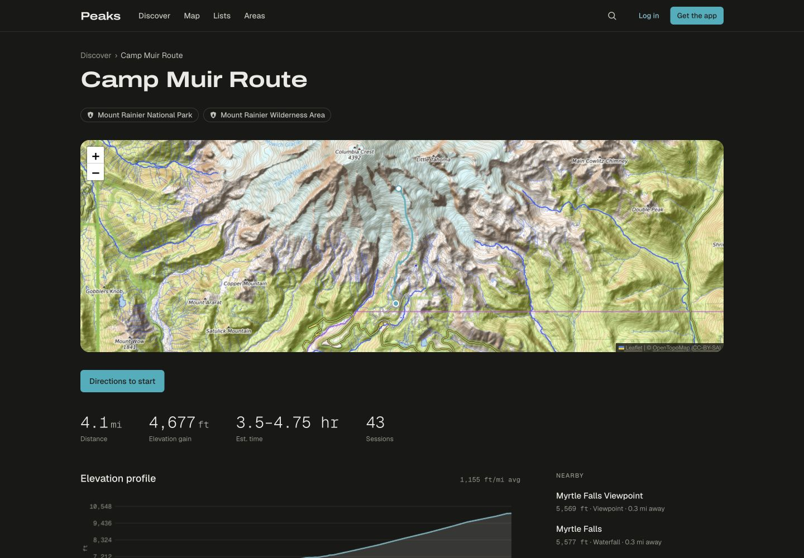
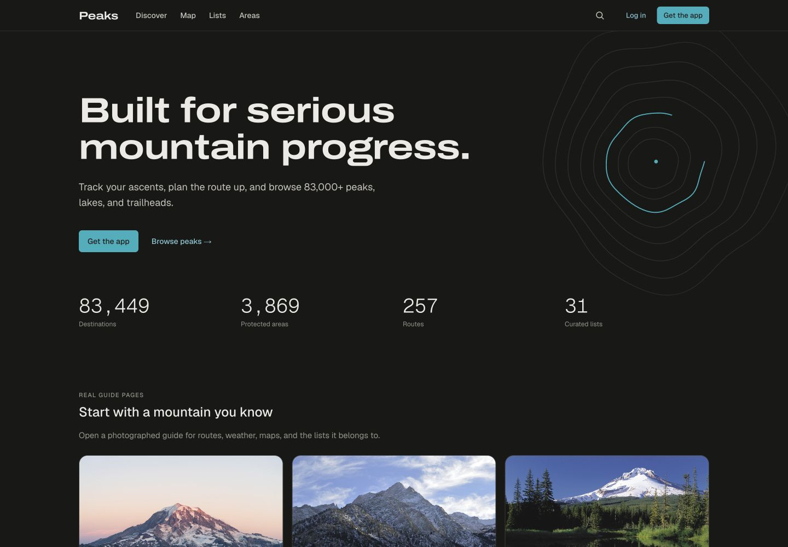
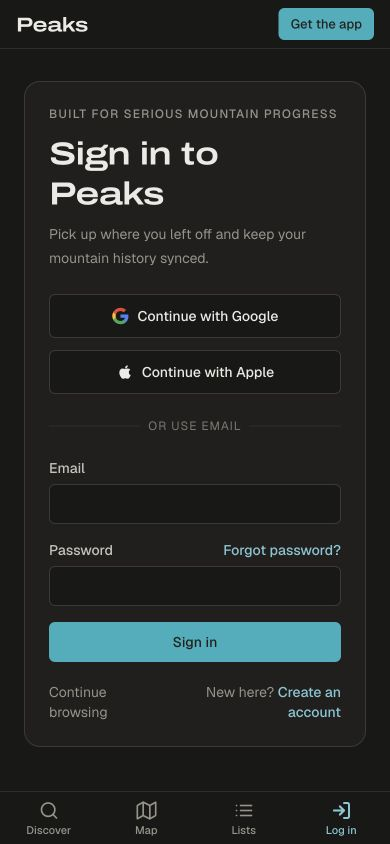
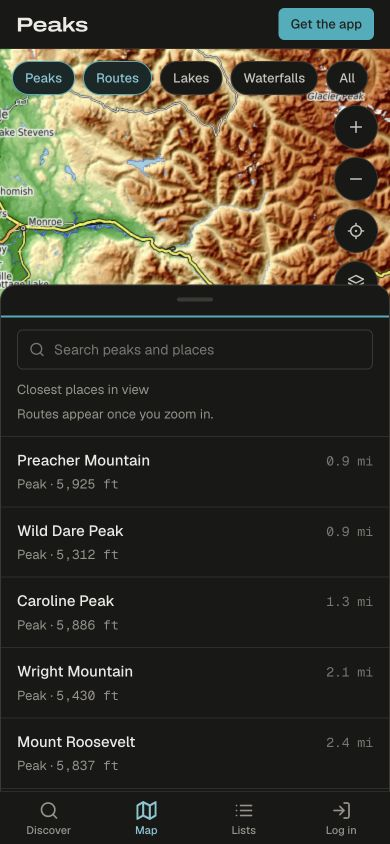

# Web touch-up screenshots

Captured from this branch's production build with the live catalog. The cover-photo
shots use the four curated records that fill the main protected-area index gaps.

## Discover — image-led destinations

## Protected areas — state filters and clear area cards

## Protected areas — credited cover photos

## Route detail — one clear stat row

## Landing — real guide pages above the feature copy

## Sign in — form first on mobile

## Map — visible search and fewer nearby markers

